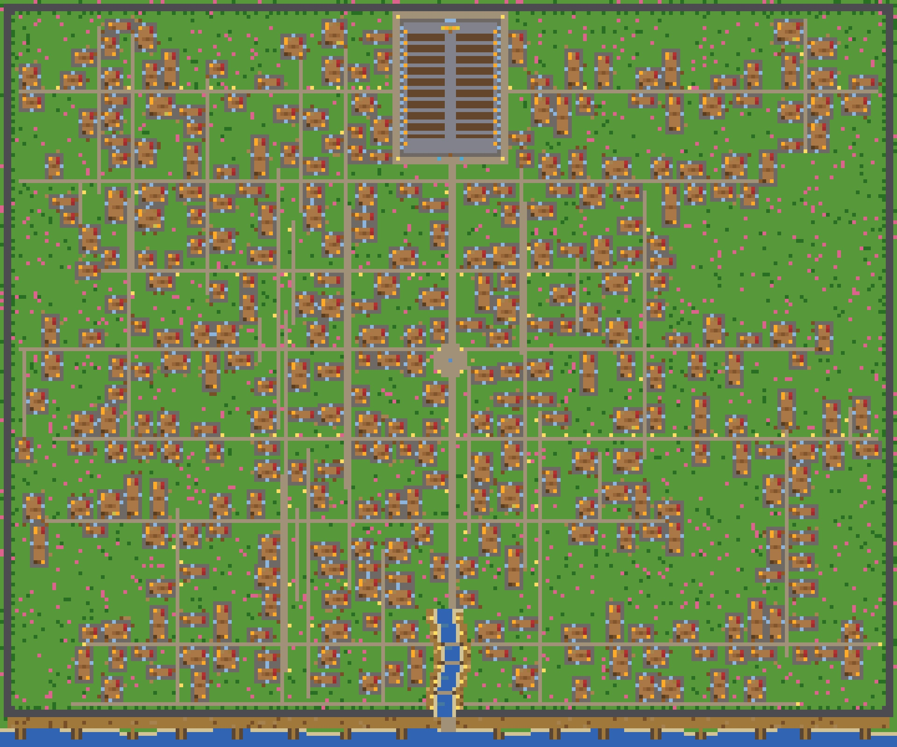
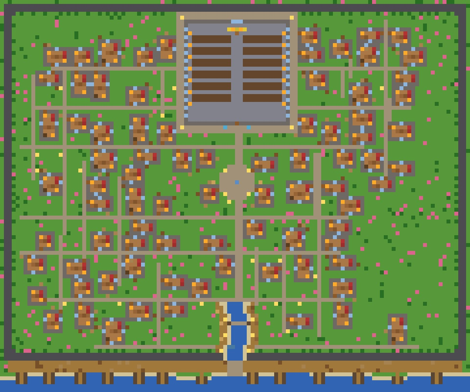
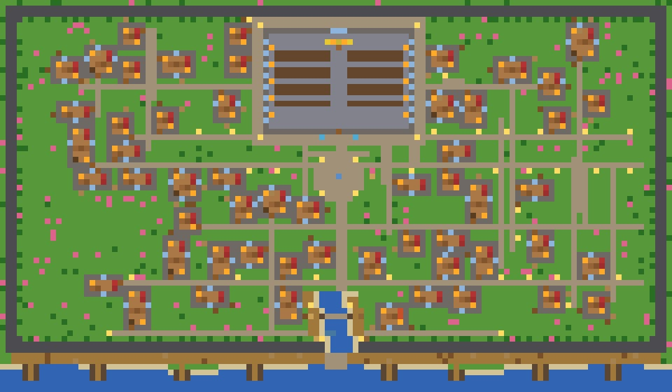

# 🏙️ Grid-mapinator

A procedural medieval city map generator written in C. Every run produces a unique, fully detailed city — with walls, roads, houses, a church, docks, a river inlet, and more — rendered in full color via SDL2.



---

## ✨ Features

- **Procedural generation** — every map is unique, seeded by randomness
- **Organic road networks** — winding streets that grow naturally through the city
- **Walled city** with a gate entrance
- **River & docks** — a shoreline with a winding canal inlet, boats, and merchants
- **Varied buildings** — rectangular and L-shaped houses, each internally furnished
- **Landmark structures** — a multi-room cathedral with courtyard, a blacksmith forge
- **Outdoor details** — trees, market stalls, fountains, lanterns, well, hay, fences
- **SDL2 viewer** — pan, zoom, and export the map as a BMP/JPG screenshot
- **One-command pipeline** — generate + render + export with a single Python script

---

## 🗺️ Example Output

| Map 1 | Map 3 |
|---|---|
|  |  |

---

## 📁 Project Structure

```
Grid-mapinator/
├── Source/          # C source files
│   ├── mapgen.c     # Procedural city generator
│   ├── mapview.c    # SDL2 map viewer & exporter
│   └── bmp_to_jpg.c # BMP → JPG converter
├── Sauce/           # Compiled binaries (built locally, not tracked by git)
├── map_txt/         # Generated map text files
├── map_preview/     # Generated map preview images
├── generate.py      # One-command pipeline script
├── Makefile         # Build system
└── LICENSE          # MIT License
```

---

## 🔧 Dependencies

| Dependency | Purpose |
|---|---|
| `gcc` | C compiler |
| `SDL2` | Map viewer & BMP export |
| `libjpeg` | JPG conversion |
| `python3` | Pipeline script |

### Installing dependencies

**macOS (Homebrew):**
```bash
brew install sdl2 libjpeg
```

**Ubuntu / Debian:**
```bash
sudo apt install libsdl2-dev libjpeg-dev
```

**Arch Linux:**
```bash
sudo pacman -S sdl2 libjpeg-turbo
```

---

## 🚀 Quick Start

### 1. Clone the repo
```bash
git clone https://github.com/KJ5678943/Grid-mapinator.git
cd Grid-mapinator
```

### 2. Build
```bash
make
```
This compiles `mapgen`, `mapview`, and `bmp_to_jpg` into the `Sauce/` folder.

### 3. Generate a map

Use the all-in-one pipeline script:
```bash
python3 generate.py <width> <height> <density> <min_house> <max_house> <output.txt>
```

**Example:**
```bash
python3 generate.py 80 60 0.4 9 36 city.txt
```

This will:
1. Generate the city map → `map_txt/city.txt`
2. Render and export it → `map_preview/city.jpg`

| Argument | Description |
|---|---|
| `width` | Map width in tiles |
| `height` | Map height in tiles |
| `density` | Building density (0.0 – 1.0) |
| `min_house` | Minimum house area (tiles²) |
| `max_house` | Maximum house area (tiles²) |
| `output.txt` | Output filename |

---

## 🖥️ Map Viewer

You can open any `.txt` map directly in the interactive viewer:
```bash
./Sauce/mapview map_txt/city.txt
```

### Controls

| Key / Action | Effect |
|---|---|
| `Scroll wheel` | Zoom in / out |
| `Click + drag` | Pan around the map |
| `S` | Save a full-map screenshot as BMP |
| `Q` / `Escape` | Quit |

---

## 🧱 Tile Legend

| Code | Tile | Code | Tile |
|---|---|---|---|
| `GF` | Grass | `WL` | Wall |
| `CP` | Cobblestone | `TR` | Tree |
| `RW` | Road | `GT` | Gate |
| `WF` | Wood Floor | `CH` | Chair |
| `WD` | Wood Door | `TB` | Table |
| `SW` | Stone Wall | `LT` | Lantern |
| `DK` | Dock | `BT` | Boat |
| `FG` | Forge | `AL` | Altar |
| `MK` | Market Stall | `FO` | Fountain |
| `SN` | Sign | `CB` | Chest |

---

## 📄 License

This project is licensed under the **MIT License** — see [LICENSE](LICENSE) for details.  
Free to use, modify, and distribute. Credit appreciated!
